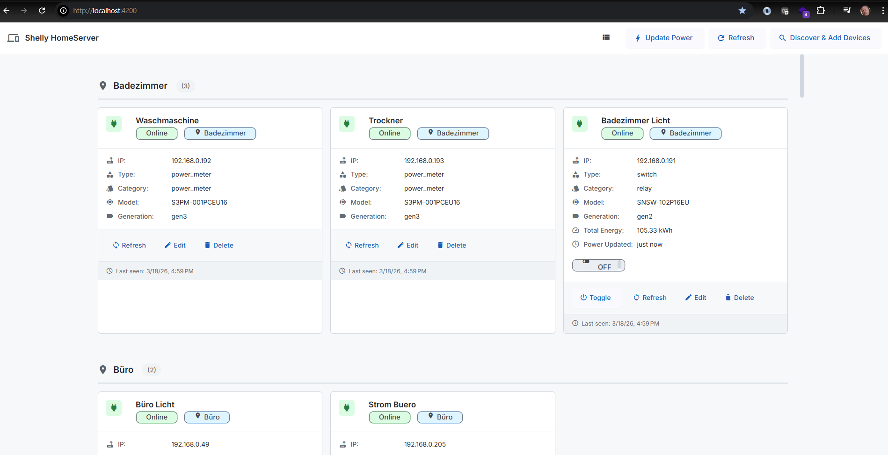

# Shelly Local Server

A local web application for managing Shelly smart home devices without cloud dependency.



## About This Project

This is my private trial for **vibe coding** - an experiment in AI-assisted development where I wanted to see if I could build a complete application using only prompts, without writing a single line of code myself.

### The Story

- I've always wanted to create a web app for my Shelly devices that doesn't rely on the cloud
- The problem: it involves a lot of boring coding and debugging
- I barely have time next to my job for such projects, so I never started
- I spend my whole day coding and architecting in my professional job, so I don't want to spend my spare time on it too
- Solution: Let AI do the coding while I focus on the architecture and requirements

### Tools & Approach

I used **GitHub Copilot** with **Claude Sonnet 4.5** for this experiment.

**Important note**: This isn't my first time using AI for coding - I use GitHub Copilot all the time at work for architecting, implementing, and prototyping. However, this is the **first time I've used it for a private project**. I've developed some practices in my professional work that turned out to be useful:

- **Keep an architecture spec in markdown from the start** - helps AI understand the big picture
- **Diagrams as code with Mermaid** - makes architecture visual and versionable
- **Use opinionated frameworks** like NestJS and Angular - they enforce good design practices like modularity, which helps AI structure code in a way that's better maintainable and extensible

### Time Investment

Altogether it took me approximately **4 hours of prompting distributed over 3 days**. I only came back to my PC from time to time. In case of errors, I just pasted the logs into the prompt. Very lazy.

### Result

Now I have a full local Shelly server with a nice UI that will allow me to control my devices even if the internet is cut off.

### Next Steps

- Add MCP (Model Context Protocol) integration

## Features

- 🔍 **Device Discovery** - Automatic network scanning via mDNS and subnet scan
- 📊 **Power Monitoring** - Real-time power consumption tracking for Shelly power meters
- 🏠 **Room Organization** - Group devices by rooms with custom categories
- 🎛️ **Device Control** - Switch devices on/off directly from the UI
- 📝 **Metadata Management** - Edit device names, rooms, categories, and relay usage
- ⚡ **Real-time Updates** - WebSocket connection for live device status updates
- 🌙 **Modern UI** - GitHub-inspired clean design with Material 3

## Architecture

The application follows a modern full-stack architecture:

- **Frontend**: Angular 21 with Material Design 3
- **Backend**: NestJS 11 with TypeScript
- **Database**: MongoDB with Mongoose ODM
- **Real-time**: Socket.IO for WebSocket communication
- **Build System**: Nx monorepo for managing frontend and backend

See [ARCHITECTURE.md](ARCHITECTURE.md) for detailed architectural documentation.

## Requirements

### Software Requirements

- **Node.js** 18.x or higher
- **npm** 9.x or higher
- **MongoDB** 6.x or higher (running on default port 27017)

### Network Requirements

- Shelly devices must be on the same local network
- Network must allow mDNS (multicast DNS) for device discovery
- Subnet scanning requires access to 192.168.0.0/24 range (configurable)

## Installation

### 1. Clone the Repository

```bash
git clone https://github.com/achimnohl/shelly-localserver.git
cd shelly-localserver
```

### 2. Install Dependencies

```bash
npm install
```

### 3. Start MongoDB

Make sure MongoDB is running on your system:

**Windows:**
```powershell
# If MongoDB is installed as a service
net start MongoDB

# Or start manually
mongod --dbpath C:\data\db
```

**Linux/Mac:**
```bash
# If installed as a service
sudo systemctl start mongod

# Or start manually
mongod --dbpath /data/db
```

### 4. Configure Database (Optional)

The application connects to MongoDB at `mongodb://localhost:27017/shelly-homeserver` by default.

To use a different database URL, set the `MONGODB_URI` environment variable:

```bash
export MONGODB_URI=mongodb://your-host:27017/your-database
```

## Running the Application

### Development Mode

Start both frontend and backend in development mode:

```bash
# Start backend (NestJS)
npm run serve:backend

# In another terminal, start frontend (Angular)
npm run serve:frontend
```

The application will be available at:
- **Frontend**: http://localhost:4200
- **Backend API**: http://localhost:3000/api

### Production Build

Build both applications for production:

```bash
npm run build:backend
npm run build:frontend
```

### Quick Start Scripts

The project includes PowerShell scripts for convenience:

```powershell
# Start the backend server
.\start-server.ps1

# Test device discovery and power monitoring
.\test-power-monitoring.ps1
```

## Getting Started

After starting the application:

1. **Open the UI**: Navigate to http://localhost:4200
2. **Discover Devices**: Click the "Discover & Add Devices" button in the top right
3. **Wait for Discovery**: The scan takes 30-60 seconds to probe your network
4. **Manage Devices**: 
   - View devices grouped by room
   - Toggle switches on/off
   - Edit metadata (names, rooms, categories)
   - Monitor power consumption in real-time

See [GETTING_STARTED.md](GETTING_STARTED.md) for detailed usage instructions.

## Project Structure

```
homeserver/
├── backend/              # NestJS backend application
│   └── src/
│       ├── main.ts
│       └── app/
│           ├── devices/     # Device management
│           ├── discovery/   # Network device discovery
│           ├── metadata/    # Device metadata
│           ├── power/       # Power monitoring
│           ├── polling/     # Background polling services
│           └── shelly/      # Shelly device adapters
├── frontend/             # Angular frontend application
│   └── src/
│       └── app/
│           ├── components/  # UI components
│           ├── models/      # TypeScript interfaces
│           └── services/    # API & WebSocket services
├── assets/              # Static assets (screenshots, etc.)
└── *.md                 # Documentation
```

## Documentation

- [ARCHITECTURE.md](ARCHITECTURE.md) - System architecture and design decisions
- [GETTING_STARTED.md](GETTING_STARTED.md) - Detailed usage guide
- [POWER_MONITORING.md](POWER_MONITORING.md) - Power monitoring feature documentation
- [IMPORT_CLOUD_METADATA.md](IMPORT_CLOUD_METADATA.md) - Cloud metadata import guide

## API Documentation

Once the backend is running, explore the API:

### Device Management
- `GET /api/devices` - List all devices
- `POST /api/devices` - Add a device manually
- `GET /api/devices/:id` - Get device details
- `POST /api/devices/:id/control` - Control a device (turn on/off)
- `DELETE /api/devices/:id` - Remove a device

### Device Discovery
- `POST /api/discovery/scan-and-save` - mDNS scan with auto-save
- `POST /api/discovery/scan-subnet-and-save` - Subnet scan with auto-save

### Metadata Management
- `GET /api/metadata` - List all metadata
- `PUT /api/devices/:id/metadata` - Update device metadata

### Power Monitoring
- `GET /api/power/current` - Get current power consumption for all devices
- `GET /api/power/device/:deviceId/latest` - Get latest power data for a device

## WebSocket Events

Connect to `ws://localhost:3000` for real-time updates:

- `deviceStateChanged` - Emitted when a device state changes
- `deviceDiscovered` - Emitted when a new device is discovered
- `powerDataUpdated` - Emitted when power consumption data is updated

## Troubleshooting

### Devices Not Discovered

- Ensure Shelly devices are on the same network
- Try subnet scan instead of mDNS: Click "Discover & Add Devices"
- Check firewall settings for mDNS (port 5353 UDP)
- Verify Shelly devices are powered on and connected to WiFi

### MongoDB Connection Issues

- Verify MongoDB is running: `mongosh` (or `mongo` for older versions)
- Check MongoDB logs for errors
- Ensure port 27017 is not blocked

### Port Conflicts

If ports 3000 or 4200 are already in use:

- Backend: Set `PORT` environment variable
- Frontend: Modify `project.json` in the frontend folder

## Technologies Used

- **Frontend**: Angular 21, Material Design 3, RxJS, Socket.IO Client
- **Backend**: NestJS 11, Express, Socket.IO Server
- **Database**: MongoDB, Mongoose
- **Build Tools**: Nx, Webpack, esbuild
- **Dev Tools**: TypeScript, ESLint, Prettier

## Contributing

This is a personal project, but feel free to fork it and adapt it to your needs!

## License

This project is for personal use. Shelly is a trademark of Allterco Robotics.

## Acknowledgments

- Built entirely using AI-assisted development (GitHub Copilot + Claude Sonnet 4.5)
- Inspired by the need for local control of smart home devices
- Thanks to the Shelly community for device API documentation
